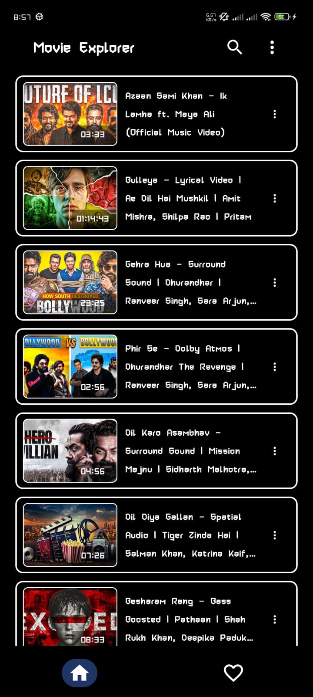
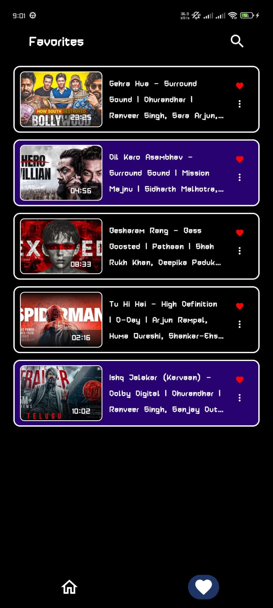
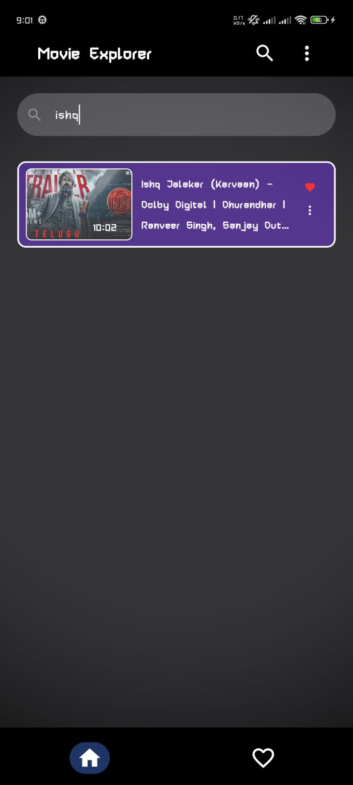
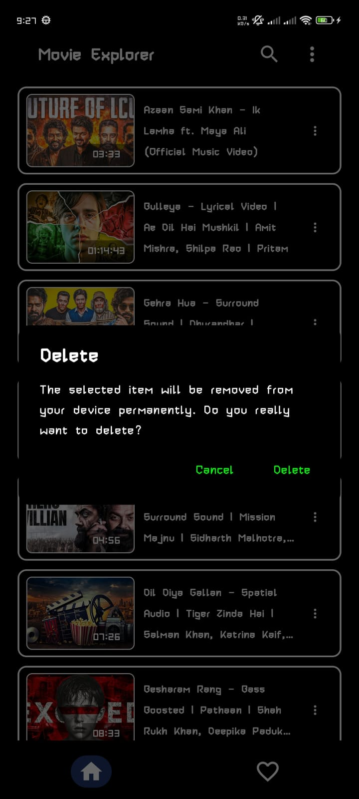
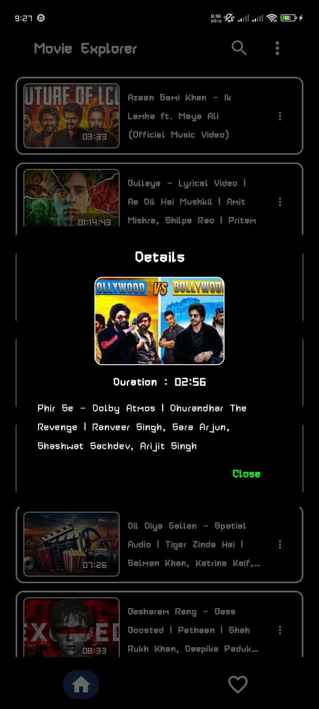

# Movie Explorer
> A simple only UI based Movie App

## Overview
> A simple movie app with some dummy movies, user can search delete all the movies in one tap, add to favorites or remove from favorite, marked as watched and as well unmarked as watched, user can delete movie one by one and also view details, there was a page dedicated to favorite screen where user can see all the add to favorite movies.

## Features
- Add to favorite
- Remove from favorite
- Search option
- Settings option on more section of topbar
- Delete all option on more section of topbar
- Dedicated favorite screen for favorite movies
- See Details and Delete one by one
- Marked as watched and unmarked as watched

## Screenshots
### Home Screen

### Favorite Screen

### Settings

### Search Option

### Delete Dialog

### Details Dialog

## Tech Stack
- Kotlin
- Jetpack Compose
- Android Studio

## What I learned?
- How the state works on multiple item
- How to filter items
- Navigation through one screen to another
- Reuse of composables
- Basic architecture 

## Future Improvement
> I don't have plan to improve this app any further

## Author
#### Md Salauddin
> Undergrade B.Tech CSE student